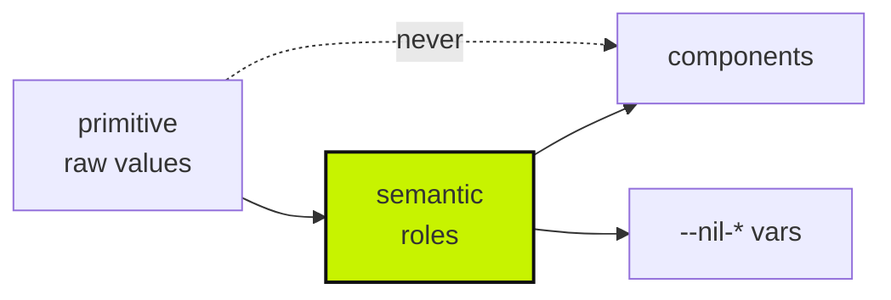

# Architecture

A token and primitive kit, agent-readable by design. Two token layers, components that
only ever reference the second, and a validator that fails the build if anything skips
the chain.

## The token chain



**Semantic is the load-bearing layer.** A component asking for `--nil-primitive-blue-600`
is a component that breaks when the brand changes; asking for `--nil-accent` is one that
does not. The dotted edge is enforced, not advisory — `tokens:validate` fails on a
hardcoded hex or a raw px.

## Why the JSON is the source

`tokens.json` generates `tokens.css`. Both are committed, and the JSON is what an agent
reads — a design system that only exists as CSS is one an agent has to parse rather than
query. That is the whole pitch: **agent-ready UI infrastructure, AI reads it.**

## Stack

- React 19 + Vite + Tailwind v4, TypeScript
- Zero runtime dependencies beyond React. `@vercel/analytics` on the demo only.
- Vitest — every primitive has a `.test.tsx` beside it
- No package published yet. That is the gap keeping it off the top band.

## Files

| Path | Job |
|------|-----|
| `src/tokens/tokens.json` | Source of truth. `primitive` and `semantic`, plus a `_readme` carrying the architecture in-band |
| `src/tokens/tokens.css` | Generated. `npm run tokens:build` |
| `src/core/core.css` | Reset and base |
| `src/core/tailwind-theme.css` | Maps semantic tokens into Tailwind |
| `src/components/*.tsx` | Primitives. Each has a test beside it |
| `scripts/` | `tokens:build` and `tokens:validate` |

## Commands that matter

```bash
npm run tokens:validate   # fails on hardcoded hex or raw px
npm run typecheck
npm test
```

`tokens:validate` is **load-bearing**. If it fails, the token-architecture claim in the
capability ledger stops being true — it is the evidence, not a linter.

## The visual line

Brutalist CLI lineage: 2px borders, 4px radius (soft brutalist), IBM Plex Sans and IBM
Plex Mono, warm off-white canvas, swappable accent. Values live in `primitive.color`
and `primitive.type` in `tokens.json`, never in this file.

**Not Soft Bento** — 16px radius, ambient glow, deep-space canvas. That belongs to
`dx-grid-inspector` and `mothership-console`. The two systems stay separate on purpose;
fusing them produces a third thing that is neither.

## Motion

Motion is tokenised on the same two layers as everything else. Durations are named by
role, not by number: `motion-duration-fast`, `-base`, `-slow`, `-enter`, `-blink`, plus
`-instant` for reduced motion. Easings are `motion-easing-standard`, `-out-expo` and
`-step`. Values live in `primitive.motion` in `tokens.json`, never in this file.

**Components reference the token, never a literal.** That is what makes the next paragraph
a single block rather than an audit.

### Reduced motion

`prefers-reduced-motion: reduce` collapses **every** duration token to
`motion-duration-instant`, in one generated block emitted by `scripts/build-tokens.mjs`.
It is derived from the semantic tokens, so a duration added later is covered without
anyone remembering this section exists. Easings are untouched: at `instant` the curve is
unobservable.

`instant` is deliberately not zero. `0s` can skip `transitionend`, which silently breaks
anything waiting on one.

**A duration is not a kill switch, and this is the trap.** Collapsing durations fixes every
transition and makes a *looping* animation worse: the cursor blink would strobe roughly a
thousand times a second, aimed precisely at the people who asked for less motion. Two things
must therefore be handled by hand in `core.css`, and they are:

| Leak | Why the token block misses it |
|---|---|
| Infinite animations (`nil-cursor-blink`) | A shorter duration makes a loop faster, not calmer. Set `animation: none` |
| `--nil-anim-delay` stagger | It is a delay, not a duration, so nothing above touches it. Elements would still march in one by one. Zeroed |

`src/tokens/reduced-motion.test.ts` enforces all of it, including a check that **no**
infinite animation in `core.css` survives without an explicit `animation: none`. Verified
by breaking it: shortening the blink instead of stopping it fails two tests.

## Out of scope

This is a showroom and a dogfood kit, **not kit-SaaS**. No pricing page, no registry
product, no monetised Figma. Ideas get noted, not built — `~/chappie/chappie/memory/kit-market-verdict.md`
is locked on that.

Architecture north star: `PLAN.md`. Applying it elsewhere: `APPLY.md`. Agent rules:
`AGENTS.md`.
